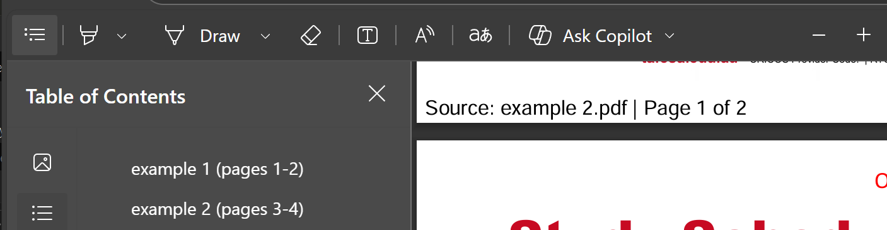

# Pdf-Ai-Prep
A Python tool for merging multiple PDF files into a single file while retaining the ability to reference their original filename using a custom footer and bookmarks. 



## Usage

### Command Line

Process all PDFs in a folder with the command:

```sh
python main.py <folder_path>
```

Example:
```sh
python main.py ./documents
# Creates: documents/documents_combined.pdf
```
### Examples

Examples of functionality are available in a notebook at [examples.ipynb](examples.ipynb)

## Output Format

Each page in the processed PDF includes a footer with:
- Original source filename
- Original page number / total pages in source document

Bookmarks are automatically generated showing:
- Original filename
- Page range in the combined document

Example: 
- `document1 (pages 1-5)`
- `document2 (pages 6-8)`

### Batch File

For Windows users, you can use the provided batch file for convenient conversion:

1. Copy [`pdf_combiner_runner.bat`](pdf_combiner_runner.bat) to the folder containing files you want to convert
2. Update the `PROJECT_PATH` variable in the batch file to point to your PDF-Ai-Prep installation
3. Run it